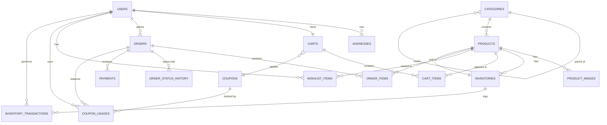

# ShopFlow — Database Schema

> Version 1.0 · PostgreSQL 16 · Updated 2026-08-15

This document defines the complete relational schema for ShopFlow. It is the source of
truth for the Laravel migrations implemented in `backend/database/migrations`.

---

## 1. Conventions

| Concern | Convention |
| --- | --- |
| Primary keys | `BIGINT UNSIGNED` auto-incrementing, column named `id` |
| Foreign keys | `{singular_table}_id`, `BIGINT UNSIGNED`, indexed |
| Timestamps | `created_at`, `updated_at` (`TIMESTAMP(0) WITH TIME ZONE`) |
| Soft deletes | `deleted_at` nullable timestamp, only where archiving is required |
| Money | `INTEGER` in minor units (cents) — never `FLOAT`/`DOUBLE`/`DECIMAL` |
| Booleans | `BOOLEAN` |
| Codes/enums | String columns with `CHECK` constraints; Laravel PHP enums mirror them |
| Table names | Plural, `snake_case` |
| JSON payloads | `JSONB` |
| Character set | `utf8mb4`-equivalent (PostgreSQL `UTF8`) |

### 1.1 Money

All monetary amounts are stored as **integer minor units** (cents). This eliminates
floating-point rounding errors and aligns with Stripe's minor-unit API.

- `price` = 2499 → `$24.99`
- Laravel casts amounts to a `Money` value object (see `App\Support\Money`).

### 1.2 Enums (mirrored in PHP)

| Column | Values |
| --- | --- |
| `users.role` | `customer`, `admin`, `manager` |
| `products.status` | `draft`, `active`, `archived` |
| `inventory_transactions.type` | `sale`, `purchase`, `adjustment`, `reservation`, `release`, `return`, `cancellation` |
| `coupons.type` | `percent`, `fixed` |
| `orders.status` | `pending`, `paid`, `processing`, `shipped`, `delivered`, `cancelled`, `refunded` |
| `orders.payment_status` | `pending`, `paid`, `failed`, `refunded` |
| `payments.status` | `pending`, `succeeded`, `failed`, `refunded` |
| `webhook_events.status` | `received`, `processing`, `processed`, `failed` |

---

## 2. Entity Relationship Diagram



---

## 3. Table Definitions

### 3.1 Identity & Authentication

#### `users`

| Column | Type | Null | Default | Notes |
| --- | --- | --- | --- | --- |
| id | bigint unsigned | NO | auto | PK |
| name | varchar(255) | NO | — | |
| email | varchar(255) | NO | — | UNIQUE |
| password | varchar(255) | NO | — | `Hash::make` |
| role | varchar(20) | NO | `customer` | CHECK in (`customer`,`admin`,`manager`) |
| email_verified_at | timestamp(0) | YES | NULL | |
| created_at | timestamp(0) | YES | NULL | |
| updated_at | timestamp(0) | YES | NULL | |

Indexes: `UNIQUE (email)`.

---

#### `addresses`

| Column | Type | Null | Default | Notes |
| --- | --- | --- | --- | --- |
| id | bigint unsigned | NO | auto | PK |
| user_id | bigint unsigned | NO | — | FK → `users.id` ON DELETE CASCADE |
| type | varchar(20) | NO | `shipping` | CHECK (`shipping`,`billing`) |
| line1 | varchar(255) | NO | — | |
| line2 | varchar(255) | YES | NULL | |
| city | varchar(255) | NO | — | |
| state | varchar(255) | YES | NULL | |
| postal_code | varchar(20) | YES | NULL | |
| country | varchar(2) | NO | — | ISO 3166-1 alpha-2 |
| is_default | boolean | NO | `false` | Per user + type |
| created_at | timestamp(0) | YES | NULL | |
| updated_at | timestamp(0) | YES | NULL | |

Indexes: `INDEX (user_id)`, `INDEX (type)`.

---

Framework tables shipped by Laravel: `password_reset_tokens`,
`personal_access_tokens` (Sanctum), `sessions`.

### 3.2 Catalog

#### `categories`

Self-referencing hierarchical categories (e.g. *Electronics → Laptops*).

| Column | Type | Null | Default | Notes |
| --- | --- | --- | --- | --- |
| id | bigint unsigned | NO | auto | PK |
| parent_id | bigint unsigned | YES | NULL | FK → `categories.id` ON DELETE SET NULL |
| name | varchar(255) | NO | — | |
| slug | varchar(255) | NO | — | UNIQUE |
| description | text | YES | NULL | |
| is_active | boolean | NO | `true` | |
| sort_order | integer | NO | `0` | |
| created_at | timestamp(0) | YES | NULL | |
| updated_at | timestamp(0) | YES | NULL | |

Indexes: `UNIQUE (slug)`, `INDEX (parent_id)`, `INDEX (is_active, sort_order)`.

---

#### `products`

| Column | Type | Null | Default | Notes |
| --- | --- | --- | --- | --- |
| id | bigint unsigned | NO | auto | PK |
| category_id | bigint unsigned | YES | NULL | FK → `categories.id` ON DELETE SET NULL |
| name | varchar(255) | NO | — | |
| slug | varchar(255) | NO | — | UNIQUE |
| description | text | YES | NULL | |
| sku | varchar(100) | NO | — | UNIQUE |
| price | integer | NO | — | Minor units (cents) |
| compare_at_price | integer | YES | NULL | Minor units; strikethrough price |
| status | varchar(20) | NO | `draft` | CHECK (`draft`,`active`,`archived`) |
| is_featured | boolean | NO | `false` | |
| archived_at | timestamp(0) | YES | NULL | Manual soft-delete |
| created_at | timestamp(0) | YES | NULL | |
| updated_at | timestamp(0) | YES | NULL | |
| deleted_at | timestamp(0) | YES | NULL | Soft delete |

Indexes: `UNIQUE (slug)`, `UNIQUE (sku)`, `INDEX (category_id)`,
`INDEX (status)`, `INDEX (price)`, `INDEX (is_featured)`.

---

#### `product_images`

| Column | Type | Null | Default | Notes |
| --- | --- | --- | --- | --- |
| id | bigint unsigned | NO | auto | PK |
| product_id | bigint unsigned | NO | — | FK → `products.id` ON DELETE CASCADE |
| path | varchar(500) | NO | — | Object key on disk (S3) |
| disk | varchar(20) | NO | `s3` | Storage disk identifier |
| alt_text | varchar(255) | YES | NULL | |
| sort_order | integer | NO | `0` | |
| is_primary | boolean | NO | `false` | Exactly one per product |
| created_at | timestamp(0) | YES | NULL | |
| updated_at | timestamp(0) | YES | NULL | |

Indexes: `INDEX (product_id)`, `PARTIAL UNIQUE (product_id) WHERE is_primary`.

### 3.3 Inventory

#### `inventories`

1:1 with products. Kept separate from `products` so that stock rows can be
**row-locked** (`SELECT ... FOR UPDATE`) during order processing without locking
hot catalog rows.

| Column | Type | Null | Default | Notes |
| --- | --- | --- | --- | --- |
| id | bigint unsigned | NO | auto | PK |
| product_id | bigint unsigned | NO | — | UNIQUE, FK → `products.id` ON DELETE CASCADE |
| quantity | integer | NO | `0` | CHECK (`quantity >= 0`) |
| reserved_quantity | integer | NO | `0` | CHECK (`reserved_quantity >= 0`) |
| low_stock_threshold | integer | NO | `5` | CHECK (`low_stock_threshold >= 0`) |
| created_at | timestamp(0) | YES | NULL | |
| updated_at | timestamp(0) | YES | NULL | |

**Concurrency contract.** `available = quantity - reserved_quantity`. All
mutations execute inside a transaction that first performs
`SELECT ... FOR UPDATE` on the affected row(s) to serialize writers. See
`docs/database/inventory-concurrency.md`.

Indexes: `UNIQUE (product_id)`, `INDEX (quantity)`.

---

#### `inventory_transactions`

Append-only audit trail explaining *why* stock changed.

| Column | Type | Null | Default | Notes |
| --- | --- | --- | --- | --- |
| id | bigint unsigned | NO | auto | PK |
| inventory_id | bigint unsigned | NO | — | FK → `inventories.id` ON DELETE CASCADE |
| user_id | bigint unsigned | YES | NULL | FK → `users.id` ON DELETE SET NULL |
| quantity_change | integer | NO | — | Signed delta |
| quantity_before | integer | NO | — | |
| quantity_after | integer | NO | — | |
| type | varchar(20) | NO | — | CHECK enum |
| reason | varchar(500) | YES | NULL | |
| reference_type | varchar(100) | YES | NULL | Morph (e.g. `order`) |
| reference_id | bigint unsigned | YES | NULL | Morph |
| created_at | timestamp(0) | YES | NULL | |
| updated_at | timestamp(0) | YES | NULL | |

Indexes: `INDEX (inventory_id, created_at)`, `INDEX (reference_type, reference_id)`,
`INDEX (type)`.

### 3.4 Cart

#### `carts`

| Column | Type | Null | Default | Notes |
| --- | --- | --- | --- | --- |
| id | bigint unsigned | NO | auto | PK |
| user_id | bigint unsigned | NO | — | UNIQUE, FK → `users.id` ON DELETE CASCADE |
| coupon_id | bigint unsigned | YES | NULL | FK → `coupons.id` ON DELETE SET NULL |
| created_at | timestamp(0) | YES | NULL | |
| updated_at | timestamp(0) | YES | NULL | |

Indexes: `UNIQUE (user_id)`, `INDEX (coupon_id)`.

---

#### `cart_items`

`unit_price` is a **snapshot** captured when the item was added, so a later product
price change does not silently alter the cart total.

| Column | Type | Null | Default | Notes |
| --- | --- | --- | --- | --- |
| id | bigint unsigned | NO | auto | PK |
| cart_id | bigint unsigned | NO | — | FK → `carts.id` ON DELETE CASCADE |
| product_id | bigint unsigned | NO | — | FK → `products.id` ON DELETE CASCADE |
| quantity | integer | NO | `1` | CHECK (`quantity > 0`) |
| unit_price | integer | NO | — | Snapshot at add time |
| created_at | timestamp(0) | YES | NULL | |
| updated_at | timestamp(0) | YES | NULL | |

Indexes: `UNIQUE (cart_id, product_id)`, `INDEX (product_id)`.

### 3.5 Wishlist

#### `wishlist_items`

| Column | Type | Null | Default | Notes |
| --- | --- | --- | --- | --- |
| id | bigint unsigned | NO | auto | PK |
| user_id | bigint unsigned | NO | — | FK → `users.id` ON DELETE CASCADE |
| product_id | bigint unsigned | NO | — | FK → `products.id` ON DELETE CASCADE |
| created_at | timestamp(0) | YES | NULL | |
| updated_at | timestamp(0) | YES | NULL | |

Indexes: `UNIQUE (user_id, product_id)`, `INDEX (product_id)`.

### 3.6 Coupons

#### `coupons`

| Column | Type | Null | Default | Notes |
| --- | --- | --- | --- | --- |
| id | bigint unsigned | NO | auto | PK |
| code | varchar(50) | NO | — | UNIQUE |
| type | varchar(20) | NO | — | CHECK (`percent`,`fixed`) |
| value | integer | NO | — | % or cents depending on type |
| min_order_amount | integer | YES | NULL | Minimum subtotal in cents |
| max_discount_amount | integer | YES | NULL | Cap in cents |
| usage_limit | integer | YES | NULL | NULL = unlimited |
| per_user_limit | integer | YES | NULL | NULL = unlimited |
| times_used | integer | NO | `0` | |
| starts_at | timestamp(0) | YES | NULL | |
| expires_at | timestamp(0) | YES | NULL | |
| is_active | boolean | NO | `true` | |
| created_at | timestamp(0) | YES | NULL | |
| updated_at | timestamp(0) | YES | NULL | |

Indexes: `UNIQUE (code)`, `INDEX (is_active, expires_at)`.

---

#### `coupon_usages`

Tracks per-order redemption and enforces per-user limits.

| Column | Type | Null | Default | Notes |
| --- | --- | --- | --- | --- |
| id | bigint unsigned | NO | auto | PK |
| coupon_id | bigint unsigned | NO | — | FK → `coupons.id` ON DELETE CASCADE |
| user_id | bigint unsigned | NO | — | FK → `users.id` ON DELETE CASCADE |
| order_id | bigint unsigned | NO | — | FK → `orders.id` ON DELETE CASCADE |
| created_at | timestamp(0) | YES | NULL | |
| updated_at | timestamp(0) | YES | NULL | |

Indexes: `UNIQUE (coupon_id, order_id)`, `INDEX (user_id)`.

### 3.7 Orders

#### `orders`

| Column | Type | Null | Default | Notes |
| --- | --- | --- | --- | --- |
| id | bigint unsigned | NO | auto | PK |
| order_number | varchar(32) | NO | — | UNIQUE, human-readable e.g. `SF-2026-000123` |
| user_id | bigint unsigned | NO | — | FK → `users.id` ON DELETE RESTRICT |
| status | varchar(20) | NO | `pending` | CHECK enum |
| payment_status | varchar(20) | NO | `pending` | CHECK enum |
| currency | varchar(3) | NO | `USD` | ISO 4217 |
| subtotal | integer | NO | — | Sum of item totals |
| discount | integer | NO | `0` | Coupon discount applied |
| tax | integer | NO | `0` | |
| shipping_fee | integer | NO | `0` | |
| total | integer | NO | — | `subtotal - discount + tax + shipping` |
| shipping_address | jsonb | NO | — | Snapshot of `addresses` row |
| billing_address | jsonb | NO | — | Snapshot of `addresses` row |
| customer_note | text | YES | NULL | |
| placed_at | timestamp(0) | YES | NULL | When checkout completed |
| created_at | timestamp(0) | YES | NULL | |
| updated_at | timestamp(0) | YES | NULL | |

**Snapshot rationale.** Addresses are copied into JSON at order time so historical
orders remain intact even if the user later edits their address book.

Indexes: `UNIQUE (order_number)`, `INDEX (user_id, created_at)`,
`INDEX (status)`, `INDEX (payment_status)`.

---

#### `order_items`

| Column | Type | Null | Default | Notes |
| --- | --- | --- | --- | --- |
| id | bigint unsigned | NO | auto | PK |
| order_id | bigint unsigned | NO | — | FK → `orders.id` ON DELETE CASCADE |
| product_id | bigint unsigned | YES | NULL | FK → `products.id` ON DELETE SET NULL |
| product_name | varchar(255) | NO | — | Snapshot |
| sku | varchar(100) | NO | — | Snapshot |
| unit_price | integer | NO | — | Snapshot |
| quantity | integer | NO | — | CHECK (`quantity > 0`) |
| total | integer | NO | — | `unit_price * quantity` |
| created_at | timestamp(0) | YES | NULL | |
| updated_at | timestamp(0) | YES | NULL | |

**Snapshot rationale.** Name/SKU/price are copied at order time; deleting or renaming
the product later never mutates historical orders.

Indexes: `INDEX (order_id)`, `INDEX (product_id)`.

---

#### `order_status_history`

Append-only audit trail of every status transition.

| Column | Type | Null | Default | Notes |
| --- | --- | --- | --- | --- |
| id | bigint unsigned | NO | auto | PK |
| order_id | bigint unsigned | NO | — | FK → `orders.id` ON DELETE CASCADE |
| from_status | varchar(20) | YES | NULL | NULL for initial state |
| to_status | varchar(20) | NO | — | |
| note | text | YES | NULL | |
| user_id | bigint unsigned | YES | NULL | FK → `users.id` ON DELETE SET NULL |
| created_at | timestamp(0) | YES | NULL | |
| updated_at | timestamp(0) | YES | NULL | |

Indexes: `INDEX (order_id, created_at)`.

---

#### `payments`

| Column | Type | Null | Default | Notes |
| --- | --- | --- | --- | --- |
| id | bigint unsigned | NO | auto | PK |
| order_id | bigint unsigned | NO | — | FK → `orders.id` ON DELETE RESTRICT |
| provider | varchar(20) | NO | `stripe` | |
| provider_payment_id | varchar(255) | YES | NULL | Stripe PaymentIntent ID |
| amount | integer | NO | — | Cents |
| currency | varchar(3) | NO | `USD` | |
| status | varchar(20) | NO | `pending` | CHECK enum |
| paid_at | timestamp(0) | YES | NULL | |
| raw_payload | jsonb | YES | NULL | Last webhook payload |
| created_at | timestamp(0) | YES | NULL | |
| updated_at | timestamp(0) | YES | NULL | |

Indexes: `UNIQUE (provider, provider_payment_id)`, `INDEX (order_id)`, `INDEX (status)`.

### 3.8 Webhooks

#### `webhook_events`

Idempotency ledger for incoming provider webhooks.

| Column | Type | Null | Default | Notes |
| --- | --- | --- | --- | --- |
| id | bigint unsigned | NO | auto | PK |
| provider | varchar(20) | NO | `stripe` | |
| event_type | varchar(100) | NO | — | e.g. `payment_intent.succeeded` |
| event_id | varchar(255) | NO | — | Provider's unique event ID |
| payload | jsonb | NO | — | Raw signed payload |
| status | varchar(20) | NO | `received` | CHECK enum |
| processed_at | timestamp(0) | YES | NULL | |
| created_at | timestamp(0) | YES | NULL | |
| updated_at | timestamp(0) | YES | NULL | |

Indexes: `UNIQUE (provider, event_id)`, `INDEX (status, created_at)`.

**Idempotency contract.** The `UNIQUE (provider, event_id)` constraint is the
enforcement mechanism: duplicate webhook deliveries raise a unique violation and
are treated as already-processed, preventing duplicate orders/payments.

### 3.9 Framework / Queue tables

Provided by Laravel: `migrations`, `jobs`, `job_batches`, `failed_jobs`, `cache`,
`cache_locks` (DB drivers only — Redis is used in production, but DB tables keep
tests self-contained).

---

## 4. Design Decisions (ADRs)

### 4.1 Inventory concurrency (row locking)

**Problem.** Two customers buying the last units of a product concurrently must not
oversell stock.

**Decision.** Inventory lives on its own `inventories` row (separate from the hot
`products` catalog row). Order placement runs inside a database transaction:

```
BEGIN TRANSACTION
  SELECT * FROM inventories WHERE product_id = ? FOR UPDATE   -- lock row
  IF available < requested THEN ROLLBACK / fail validation
  UPDATE inventories SET reserved_quantity = reserved_quantity + ?   -- reserve
  INSERT order + order_items
COMMIT
```

`FOR UPDATE` serializes writers on the same inventory row; the reserved-then-commit
pattern holds stock until payment confirms, after which `reserved_quantity` is
converted to a real decrement.

### 4.2 Money as integer cents

See §1.1. Applied to: `products.price`, `products.compare_at_price`,
`cart_items.unit_price`, `coupons.value`, `coupons.min_order_amount`,
`coupons.max_discount_amount`, all `orders.*` money columns, `payments.amount`.

### 4.3 Snapshotting

Historical immutability where it matters:

- `cart_items.unit_price` — price at add time.
- `order_items.product_name|sku|unit_price` — catalog immutability.
- `orders.shipping_address|billing_address` — address-book immutability.

### 4.4 Soft delete vs. archive

`products` use Laravel soft deletes **plus** a `status` enum. `archived` status
removes from storefront while preserving history; hard delete removes entirely.

### 4.5 Webhook idempotency

`webhook_events` unique constraint (§3.8). Webhook handlers are written to be
replayed safely: processing the same event twice must be a no-op.

### 4.6 Roles

Three fixed roles stored as a `role` string column with a CHECK constraint
(§3.1) rather than a normalized `roles`/`role_user` pair — simpler, faster, and
sufficient given the role set is static. PHP `enum Role` mirrors the values.
